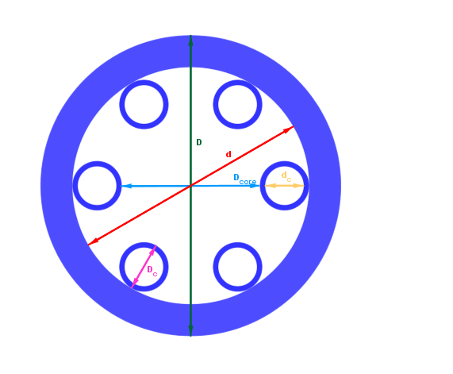

# Tubular Anti-resonant Hollow-core fibers drawing simulation

### Description

This application allows to compute the drawing parameters to realize a tubular hollow-core optical fiber. The method used in this software is that described in the paper of Jasion *et al.* [[1]](#1) with two minor corrections:

- The tab "Direct computation" computes the evolution of all the structural fiber parameters during the drawing process with the input chosen by the user.
- The tab "Optimization" computes the pressures and the furnace temperature that allow to obtain a target fiber from a given preform.
- The tab "Parameters" (in v1.3) allows to modify the materials properties that can depends on the temperature.

### Installation

The application has been designed with MATLAB R2024b with the optimization and parallel toolboxes. It can be launched directly from the source code: the main file is *HARF_drawing.mlapp*. If you do not have this matlab version/toolbox, an installation file for windows 10/11 is provided in the release. 

### Citation
If you use this software in a publication, you can cite it as follow:
O. Vanvincq, "Harf-drawing" (2019), https://doi.org/10.5281/zenodo.3582197

### User manual

All the distances used in the program are shown in the picture below.

List of the parameters used in the program :

- *Pcore* : core pressure 
- *Pcap* : overpressure between capillaries and core
- *Feed speed* : speed of the preform 
- *Vf* : drawing speed
- *L* : computing length. must be greater than the furnace length.
- *D0* and *Df* : value of *D* at *z=0* (preform) and *z=L* (fiber)
- *Dc0* and *Dcf* : value of *Dc* at *z=0* (preform) and *z=L* (fiber)
- *d0* and *df* : value of *d* at *z=0* (preform) and *z=L* (fiber)
- *dc0* and *dcf* : value of *dc* at *z=0* (preform) and *z=L* (fiber)
- *tf* : fiber capillaries thickness, *tf=(Dcf-dcf)/2*
- *Dcore* : fiber core diameter
- *Draw tension* : draw tension at *z=L*
- *Tmax* : maximum temperature of the furnace. At *z=0*, the preform temperature is assumed to be equal to the furnace temperature decreased by 500°C.
- *Furnace length* : must be lower than *L*. The température outside the furnace is fixed to 20°C.
- *Furnace temperature profile* : function of *z* that described the evolution of the normalized furnace temperature (*T/Tmax*) between *z=0* and the *furnace length*
- *Max(Rc/Rcontact)* : if this value is greater than 1, the capillaries are in contact and the fiber is deformed.

### References

<a id="1">[1]</a> [Gregory T. Jasion, John R. Hayes, Natalie V. Wheeler, Yong Chen, Thomas D. Bradley, David J. Richardson, and Francesco Poletti "Fabrication of tubular anti-resonant hollow core fibers : modelling, draw dynamics and process optimization", Opt. Express, 27(15) :20567-20582, 2019.](https://doi.org/10.1364/OE.27.020567)
